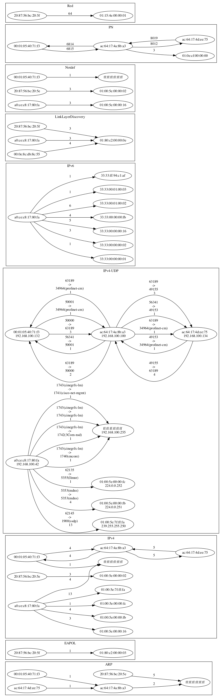

# neTTool - A small tool to analysis profiNET connections

## Description

The aim of the tool is to analyse profiNET connections as part of a laboratory setup.

## Dependencies

* graphviz to visualize the connections
* Golang, if you want to build your own version
* Wireshark to capture network traffic
* plantuml for node overview

## Installing

* Download the pre compiled version or build your version of the software

## Executing program

* Capture network traffic with Wireshark in a pcap file
* Run the program
  * Load pcap-file
  * Analyse pcap-file
  * Save results in zip-file
* Analyse the results inside the "zip" file

## Testing with example data

Testing purposes you can use the example data inside the folder "release/TestData". The results for the file "versuchsaufbau01.pcap" are shown in the following graphics.

### Connection Graph 
Result: networkgraph.png and networkgraph.gv (dot-source-file)

Shows the connections between the participants per protocol type.

Please note
* The arrows usually indicate the number of exchanged packets.
* IPv4-UDP and TCP contain, in addition to the number of packets, the port numbers used for communication and details of the communication protocol used.
* IPv4 contains what does not belong to IPv4-UDP or IPv4-TCP.



### ProfiNet-Results
Result: boxplot.pdf and boxplotStatistics.txt

Boxplot of the PN communication (timing) between to nodes. 


Statistic-Values of the Boxplot

----------------------------------------------
00:01:05:40:71:f3->ac:64:17:4a:8b:a3|8892
Max            : 5.159000ms
Upper Whisker  : 2.052000ms
75% Quantil    : 2.012000ms
Median         : 1.999000ms
25% Quantil    : 1.985000ms
Lower Whisker  : 1.945000ms
Min            : 0.082000ms

----------------------------------------------
ac:64:17:4a:8b:a3->ac:64:17:4d:ee:75|8892
Max            : 5.870000ms
Upper Whisker  : 2.048000ms
75% Quantil    : 2.011000ms
Median         : 1.999000ms
25% Quantil    : 1.986000ms
Lower Whisker  : 1.949000ms
Min            : 0.098000ms

----------------------------------------------
ac:64:17:4a:8b:a3->00:01:05:40:71:f3|8892
Max            : 6.458000ms
Upper Whisker  : 2.055000ms
75% Quantil    : 2.014000ms
Median         : 2.000000ms
25% Quantil    : 1.986000ms
Lower Whisker  : 1.945000ms
Min            : 0.068000ms

----------------------------------------------
ac:64:17:4d:ee:75->ac:64:17:4a:8b:a3|8892
Max            : 6.125000ms
Upper Whisker  : 2.036000ms
75% Quantil    : 2.008000ms
Median         : 1.999000ms
25% Quantil    : 1.989000ms
Lower Whisker  : 1.961000ms
Min            : 0.068000ms

### Nodes
Result: nodes.plantuml

Plantuml file showing all participants involved in communication.

```
@startuml
nwdiag {
network test_network {
node_0[address=  " 00:01:05:40:71:f3 , 192.168.100.132 "]
node_1[address=  " ac:64:17:4a:8b:a3 , 192.168.100.100 "]
node_2[address=  " ac:64:17:4d:ee:75 , 192.168.100.134 "]
node_3[address=  " 20:87:56:bc:20:5e , 192.168.100.125 "]
node_4[address=  " a0:ce:c8:17:80:fa , 192.168.100.42 "]
}
' Multicast-Nodes
' Multicast: node [address=  " 01:00:5e:00:00:fb , 224.0.0.251 "]
' Multicast: node [address=  " 01:00:5e:00:00:02 , 224.0.0.2 "]
' Multicast: node [address=  " 01:00:5e:7f:ff:fa , 239.255.255.250 "]
' Multicast: node [address=  " 01:00:5e:00:00:fc , 224.0.0.252 "]
' Multicast: node [address=  " ff:ff:ff:ff:ff:ff , 192.168.100.255 "]
' Multicast: node [address=  " 01:00:5e:00:00:16 , 224.0.0.22 "]
' Multicast: node [address=  " ff:ff:ff:ff:ff:ff , 255.255.255.255 "]
@enduml
```

The file can be converted into a graphic via plantuml.


## Cross compile
on Mac-OS for Windows OS

```console
foo@bar:~$ fyne-cross windows -arch=386       
foo@bar:~$ brew install mingw-w64
foo@bar:~$ CGO_ENABLED=1 CC=i686-w64-mingw32-gcc CXX=i686-w64-mingw32-g++ GOOS=windows GOARCH=386 go build neTTool.go
```

## Authors

André Wenzel

## Version History
* 1.3.4
  * Spell issues
  * Port and adapter cleaner
  * more SOLID
  * update documentation
* 1.3.3 
  * Node export
  * Spell issues
* 1.3.2
  * Update all packages to fix vulnerability
* 1.3.1
  * PN-Check added
* 1.3.0
  * Add IPv4 detail analysis for UDP and TCP in connection graph
  * Change direction graph layout a bit to make it look nicer
* 1.2.1
  * GUI Improvements
* 1.2.0
  * GUI Added, need for config-file removed
* 1.1.0
    * First public Release

## License

This project is licensed under the  MIT License see the LICENSE.md file for details

## Some Architecture drawings

### Analysis of the network data, ready for export

Code structure


Code behavior

