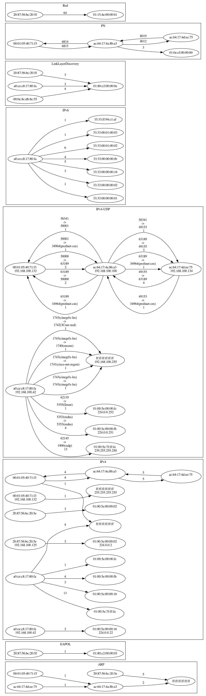

# neTTool - A small tool to analysis profiNET connections

## Description

The aim of the tool is to analyse profiNET connections as part of a laboratory setup.

## Dependencies

* graphviz to visualize the connections
* Golang, if you want to build your own version
* Wireshark to capture network traffic

## Installing

* Download the pre compiled version or build your version of the software

## Executing program

* Capture network traffic with Wireshark in a pcap file
* Run the program
  * Load pcap-file
  * Analyse pcap-file
  * Save results in zip-file
* Analyse the results inside the "zip" file

## Testing with example data

Testing purposes you can use the example data inside the folder "release/TestData". The results for the file "versuchsaufbau01.pcaapng" are shown in the following graphics.

### Connection Graph



### Profinet-Results

Boxplot


Statistic-Values

----------------------------------------------
ac:64:17:4a:8b:a3->ac:64:17:4d:ee:75|8892
Max            : 5.870000ms
Oberer Wisker  : 2.048000ms
75% Quantil    : 2.011000ms
Median         : 1.999000ms
25% Quantil    : 1.986000ms
Unterer Wisker : 1.949000ms
Min            : 0.098000ms

----------------------------------------------
ac:64:17:4d:ee:75->ac:64:17:4a:8b:a3|8892
Max            : 6.125000ms
Oberer Wisker  : 2.036000ms
75% Quantil    : 2.008000ms
Median         : 1.999000ms
25% Quantil    : 1.989000ms
Unterer Wisker : 1.961000ms
Min            : 0.068000ms

----------------------------------------------
ac:64:17:4a:8b:a3->00:01:05:40:71:f3|8892
Max            : 6.458000ms
Oberer Wisker  : 2.055000ms
75% Quantil    : 2.014000ms
Median         : 2.000000ms
25% Quantil    : 1.986000ms
Unterer Wisker : 1.945000ms
Min            : 0.068000ms

----------------------------------------------
00:01:05:40:71:f3->ac:64:17:4a:8b:a3|8892
Max            : 5.159000ms
Oberer Wisker  : 2.052000ms
75% Quantil    : 2.012000ms
Median         : 1.999000ms
25% Quantil    : 1.985000ms
Unterer Wisker : 1.945000ms
Min            : 0.082000ms

## Cross compile
on Mac-OS for Windows OS

```console
foo@bar:~$ fyne-cross windows -arch=386       
foo@bar:~$ brew install mingw-w64
foo@bar:~$ CGO_ENABLED=1 CC=i686-w64-mingw32-gcc CXX=i686-w64-mingw32-g++ GOOS=windows GOARCH=386 go build neTTool.go
```

## Authors

André Wenzel

## Version History

* 1.2.0
  * GUI Added, need for config-file removed
* 1.1.0
    * First public Release

## License

This project is licensed under the  MIT License see the LICENSE.md file for details
